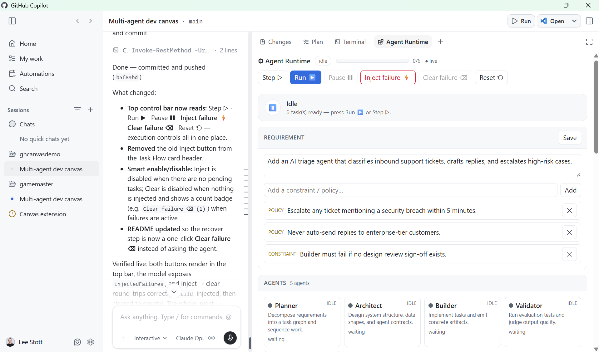

# Agent Runtime — a multi-agent development Canvas

[](https://github.com/leestott/agent-runtime-canvas)
[](https://nodejs.org)
[](#run-the-demo)
[](https://github.com/leestott/agent-runtime-canvas/commits/main)
[](https://github.com/leestott/agent-runtime-canvas/stargazers)
[](LICENSE)

A GitHub Copilot CLI **canvas extension** that turns Canvas into a **runtime
observability & control plane** for a multi-agent software system being designed,
tested, and evolved in real time — *not* a static UI.

The canvas renders one living **SystemModel** that **both humans and the AI agent
edit at the same time**. The agent drives it through five canvas actions; the human
drives it through the panel's controls. Every change streams to the iframe over
Server-Sent Events, so the system visibly evolves through interaction.



*The Agent Runtime canvas open beside the chat — control bar, activity spotlight, requirement & constraints, and the live agent roster.*

## What it demonstrates

> Canvas is not a UI builder — it is a runtime for shaping intelligent systems.

- **Observability** — agents, their roles and live status; a task-flow graph; the
  artifacts each agent emits; a change timeline.
- **Steerability** — trigger agent actions, pause/resume execution, inject failures,
  and edit requirement / constraints / shared state directly in the panel.
- **Continuous validation** — an evaluation suite with pass/fail indicators and
  reasoning, re-runnable as the design changes.

## Panels

| Panel | Shows |
|-------|-------|
| **Requirement & constraints** | The feature under design + editable policies/constraints |
| **Agents** | Active agents, responsibilities, and current state (idle/working/done/error/blocked) |
| **Task Flow** | The dependency graph of tasks across agents, with live status |
| **Artifacts** | Intermediate outputs produced by each task |
| **Validation** | Test cases, pass/fail, expected vs. actual, and reasoning |
| **Live State** | Shared memory objects the agents use — directly human-editable |
| **Timeline** | Change-over-time log, including state before→after diffs |

## Agent actions

The agent co-creates and evolves the system by calling:

| Action | Effect |
|--------|--------|
| `decompose_system` | Break a requirement into collaborating agents + a task-flow graph |
| `execute_workflow` | Coordinate agents to advance tasks (`step`/`run`/`pause`/`resume`/`reset`) |
| `validate_output` | Run evaluation tests, return structured pass/fail + reasoning |
| `update_system_design` | Modify architecture/logic: requirement, constraints, agents, tasks |
| `track_state` | Persist/update a shared state object, recording the diff on the timeline |

## Scenarios

- **Design a feature end-to-end** — open with a `requirement`; the agent calls
  `decompose_system`, then `execute_workflow` to watch agents collaborate.
- **Observe collaboration** — Run the workflow and watch agent states, the task
  graph, and artifacts update live.
- **Inject failure / constraints** — click *Inject failure ⚡* (or the agent injects
  one); downstream tasks become *blocked* and the system adapts.
- **Iterate via validation loops** — run tests, see what fails and why, call
  `update_system_design`, re-run, re-validate.

## Layout

```
.github/extensions/agent-runtime/
  extension.mjs   # wiring: loopback server, SSE, /control, 5 canvas actions
  store.mjs       # durable SystemModel + execution engine + validation
  ui.mjs          # iframe renderer (system view · validation · state · timeline)
```

## Run the demo

### Prerequisites

- **GitHub Copilot CLI / app** with canvas support (the `canvas-renderer` capability).
- This repository opened as the **workspace** (clone it, then open the folder).
  No `npm install` is needed — `@github/copilot-sdk` is auto-resolved by the CLI and
  the extension uses only Node's built-in modules.

### 1. Load the extension

The extension is auto-discovered from `.github/extensions/agent-runtime/` when the repo
is your workspace. To confirm it loaded (or after editing it), reload extensions and
inspect:

- Reload: run the **reload extensions** command (or restart the session).
- Verify: the **Agent Runtime** canvas appears in the canvas catalog / `<canvases>` list.

If it shows as *failed*, inspect the extension's log (the inspect output prints the log
path) — `stdout` is reserved for JSON-RPC, so all diagnostics go to that log.

### 2. Open the canvas

Ask Copilot to **open the Agent Runtime canvas**, optionally seeding a requirement:

> Open the Agent Runtime canvas with the requirement "Add CSV export to the reports page".

The panel opens on the right with seven sections (Requirement, Agents, Task Flow,
Artifacts, Validation, Live State, Timeline).

### 3. Walk the loop

Drive it with the panel controls **and/or** by asking the agent to call the actions —
both funnel through the same live model. The panel's control bar has **Step ▷**,
**Run ▶** (also resumes from pause), **Pause ❚❚**, **Inject failure ⚡**,
**Clear failure ⌫**, and **Reset ⟲**; the Validation panel has **Run tests ✓**.

1. **Decompose** — ask the agent to `decompose_system` (there's no panel button for
   this) → 5 agents (Planner, Architect, Builder, Validator, Reviewer) and a 6-task
   graph appear, all *pending*.
2. **Execute** — click **Run ▶** (or `execute_workflow`) and watch the spotlight banner
   track the active agent, the progress bar fill, and artifacts appear as each task
   completes. Use **Pause ❚❚** / **Run ▶** to pause-resume, and **Step ▷** to advance one
   task at a time.
3. **Validate** — click **Run tests ✓** (or `validate_output`) → 5/5 tests pass with
   expected-vs-actual reasoning.
4. **Inject failure** — click **Inject failure ⚡** then **Reset ⟲** + **Run ▶**. The
   `build` task fails, its downstream tasks (`validate`, `review`) go *blocked*, and
   validation drops to 4/5.
5. **Recover** — click **Clear failure ⌫** (Reset alone does *not* clear an injected
   failure), then **Reset ⟲** + **Run ▶** again → 6/6 done, validation back to 5/5. The
   Timeline shows the whole before→after history.
6. **Edit live** — change a constraint or a Live State value directly in the panel, or
   ask the agent to `update_system_design` / `track_state`, then re-validate.

### Tuning execution speed

`execute_workflow` accepts an `intervalMs` (the visible dwell per task, default ~1100ms)
so you can slow the run down for a presentation or speed it up for a quick check.

State persists per `documentId` under `~/.copilot/extensions/agent-runtime/artifacts/`,
so a reload or reopen resumes exactly where you left off.

## How it works

- The iframe is served from a loopback HTTP server (one per open instance) and
  subscribes to `/events` (SSE). It POSTs human controls to `/control`.
- The `SystemStore` is an `EventEmitter`: every mutation bumps a version, appends a
  timeline entry, persists to disk, and broadcasts a fresh snapshot to all panels.
- Canvas actions and human controls funnel through the *same* store, so the agent
  and the human are editing one shared, live system.

---

Built as a demonstration of the Copilot Canvas extension runtime.

## License

Released under the [MIT License](LICENSE).
